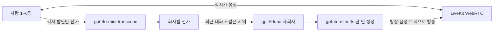
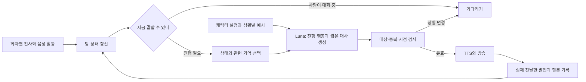

# 수다 라운지: 테스트 구현과 운영 기획

기준: 2026-10-01 한국 시간. 비용은 USD, 세금·환전 수수료 제외.

## 경험과 화면

2026-10-02 서비스의 기본 진입을 라운지로 옮겼다. `/`는 `/lounge`로 이동하고 메인 상단에 회원가입·로그인을 제공한다. 회원가입 버튼은 가입 탭을 바로 열고, 기존 회원은 닉네임·아바타 버튼에서 프로필 수정 화면을 열어 닉네임과 사진 아바타를 관리한다. 변경 결과는 라운지 상단에 바로 반영된다. 게스트에게는 가입·로그인을 제공하고 회원 프로필 편집은 표시하지 않는다. 방 안에서는 계정 전환 대신 라운지로 돌아가는 링크를 표시한다. 기존 회원 DB와 인증을 재사용하며 이 변경에 새 SQL은 필요하지 않다.

로그인·회원가입·프로필 수정과 가입 확인/아바타 준비 화면을 공통 라운지 디자인으로 다시 구성했다. 루프탑 풍경은 짙은 올리브색 패널로 이어지고 따뜻한 크림색 글자와 금빛 버튼을 사용한다. 데스크톱은 풍경/입력 영역을 나란히 두고 모바일은 짧은 풍경 헤더 아래에 폼을 둔다. 프로필은 닉네임 미리보기와 사진 아바타 관리를 연결하며 가입 사진은 선택 영역으로 접어 둔다. 이메일 폼은 Enter로 제출하고 모달은 배경 스크롤 잠금·키보드 포커스 유지·Escape/배경 클릭 닫기·원래 버튼으로 포커스 복귀를 지원한다.

빌드·수정 파일 ESLint, 로그인/가입 320·390·768·1440px 및 실제 프로필/아바타 편집 화면 320·390·1440px 배치를 확인했다. 모의 인증 검사에서 가입 사진·동의·미리보기·변환/저장 실패 후 재시도·이메일 인증 대기와 닉네임/아바타 갱신을 검증했다. 실제 가입이나 유료 이미지 요청은 실행하지 않았다. 화면 예시는 [로그인](lounge-account-login-desktop.png), [모바일 회원가입](lounge-account-signup-mobile.png), [프로필 수정](lounge-account-profile-desktop.png)에 저장했다.

토론·페르소나 상황극 옆에, 가볍게 이야기하고 기분을 푸는 엔터테인먼트 공간을 추가했다. 크림색 바탕과 세이지 그린, 복숭아·라일락 포인트, 둥근 좌석으로 작은 거실 분위기를 구성했다. 평가·점수·승패는 없다.

2026-10-02 대화방은 ‘전망과 대화석’ 구도로 바꿨다. 여섯 풍경은 상단에 넓게 보여 주고, 사진 하단을 테마별 대화석 색으로 연결한다. 풍경 높이는 후속 변경에서 기존의 약 1.75~1.8배로 늘렸다. 참가자 프로필은 큰 카드 대신 얼굴·이름·마이크·발언 상태로 모으고, 오늘의 주제와 사회자 대사를 같은 대화 공간에 둔다. 대화 기록은 기본으로 접으며 오른쪽 탭이나 상단 버튼으로 고정 패널을 연다. 풍경 폭과 화면 스크롤 위치는 유지한다. ‘글로 이야기하기’는 기록을 펼치고 입력창으로 이동한다. 접어도 작성 중인 글은 유지한다. 1:1부터 6명과 모바일 배치를 지원하고 기본 아바타는 원래 이미지 비율을 유지해 자른다. 메인 헤드라인 뒤에는 여백을 유지하고 오른쪽은 클럽 라운지 사진으로 교체했다. [클럽 라운지와 기록 패널 변경](./lounge-club-and-records-update.md)

이 화면 변경은 TypeScript·프로덕션 빌드·수정 파일 ESLint를 통과했다. 실제 화면의 320~1440px, 1~6자리, 세 테마, 발언 표시·아바타 선택·반복 글 대화를 확인했고, 기록 열기 시 화면 이동·입력 포커스·접기 후 초안 유지·Escape로 접기를 검증했다. 실제 방 컴포넌트의 자동 연결·마이크·시작은 기존 모의 검사에서 통과했다. 이번 디자인 검증에서는 유료 AI 요청이나 실제 다중 사용자 음성 연결을 실행하지 않았다.

혼자 AI 사회자와 1:1 또는 사람 2~6명과 AI 사회자 한 명, 최대 60분. AI는 정원에 포함되지 않는다. 1:1 방은 인원 선택에서 ‘혼자’를 고르고 ‘AI와 1:1 대화 시작’을 누르면 입장·음성 연결·마이크 권한 요청·대화 시작이 이어진다. 여러 사람 방은 친구 초대형이다. 메인 주소에서 라운지로 들어간다. 로그인 없이 화면 미리보기를 볼 수 있고, 실제 방은 기존 회원 또는 익명 로그인으로 참여한다.

주제 분야는 영화 수다, **책 속으로**(소설·에세이 등), 여행과 산행 풍경, 드라마·예능·OTT, 먹거리와 맛집, 소소한 행복의 6종을 제공한다. 2026-10-03부터 메인에서 방을 만들려면 작품명·장소 등 구체적인 주제를 1~160자로 직접 입력해야 한다. 분야 카드만 선택하거나 공백만 입력하면 방 생성과 메인 미리보기를 시작할 수 없다. 분야를 바꿔도 이미 작성한 주제는 유지하며, 입력 예시만 바뀐다. 생성 함수도 빈 주제와 160자를 넘는 주제를 RPC 호출 전에 거절한다. 책 분야는 최근 읽은 책에서 마음에 남은 내용이나 문장과 그 이유를 대화 소재로 안내한다.

서비스 소개의 대화 예시는 현재 배치에 맞춰 주제를 위, 사회자를 왼쪽, 참가자와 발언·조작 버튼을 오른쪽에 둔다. 전체 풍경을 가리는 발언 상자를 제거하고 텍스트 뒤에만 작은 블러를 적용한다. 모바일 예시는 사진 높이를 늘려 주제와 프로필이 겹치지 않게 한다. 소셜·친구 기능은 아직 기획 단계이며, [대화 친구와 재초대 기획](./lounge-social-friends-plan.md)에 상호 선택·친구 목록·초대·차단·사진 공개 범위와 구현 순서를 정리했다.

사회자는 작품 지식을 평가하기보다 감상·취향·내 경험으로 대화를 잇는다. 작품을 감상한 뒤 후기를 나누는 공간으로 결말과 반전까지 기본 허용한다. 최신 이슈는 현재 참가자가 가져온 내용으로 진행하며 자동 뉴스 검색·기사 공급은 구현하지 않았다. 다음 단계에서는 발행일·출처가 있는 문화/생활 기사 카드를 방 만들기 전에 선택하도록 구성한다. 기사 내용은 방당 한 번 준비하고 요약을 공유해 매 턴 검색 비용이 중복되지 않게 한다.

| 사회자 | 진행 성격 | 질문의 예 |
| --- | --- | --- |
| 재치 있는 진행자 | 포용적인 진행, 앞선 이야기를 연결하는 유머, 골고루 참여 유도 | 그때 친구가 옆에 있었으면 뭐라고 했을까요? |
| 공감하는 진행자 | 작은 감정에 관심, 다정한 질문, 섬세한 언어 | 그 순간 어떤 기분이 들었어요? |
| 활기찬 진행자 | 밝은 리액션, 가벼운 상상 질문 | 다시 경험한다면 무엇을 해 보고 싶어요? |
| 발랄한 진행자 | 다정한 장난, 밝은 반응, 가까운 친구 같은 수다 | 어떤 순간이 자꾸 생각났어요? |

인물 이름 대신 질문과 분위기의 차이를 나타내는 진행 스타일을 선택한다. 화면과 모델 지시 모두 특정 인물의 이름을 사용하지 않으며, 사진은 AI 생성 가상 인물, 목소리는 AI 합성 음성으로 안내한다. 진행 스타일 목록은 `src/lib/lounge.ts`에서 관리한다. 대화 행동 지시와 TTS 전달 지시를 분리하고 각 스타일의 음색·속도·억양을 설정한다. 선택 카드에서 실제 TTS로 만든 고정 음성 예시를 들을 수 있으며 예시 재생에는 추가 LLM/TTS 호출이 없다. 기존 방과 링크가 계속 동작하도록 저장된 호스트 ID는 유지하며 DB 마이그레이션 없이 적용된다. 세부 설정·검증·생성 프롬프트는 [사회자 스타일 변경 기록](./lounge-host-style-update.md)을 참고한다.

## 현재 진행 규칙

방 입장 시 음성과 마이크를 자동으로 준비한다. 1:1은 소리 재생 준비와 마이크 권한 확인을 마치면 자동 시작한다. 브라우저가 재생을 차단하면 ‘소리 켜기’ 한 번으로 이어서 시작한다. 마이크 권한 거절 시 다시 허용할 수 있는 마이크 버튼과 안내를 제공하고, 소리 재생이 가능하면 듣기·글 대화로 시작한다. 연결 실패는 자동으로 반복하지 않고 ‘연결 다시 시도’를 제공한다. 여러 사람 방은 방장이 링크를 공유하고 실제 음성 연결 인원 2명 이상일 때 방장이 시작한다. 첫 발언은 주제에 맞는 아이스브레이커, 이후에는 구체적인 최근 이야기를 받아 공감하고 질문 하나를 붙인다. 사람을 지목할 때도 패스할 자유를 준다.

인간의 음성 활동 중에는 새 AI 발언을 시작하지 않는다. 생성 중 사람이 다시 말하면 음성 재생을 건너뛴다. **1:1은 마지막 실제 음성 뒤 2초 쉼, 전사 저장·화면 갱신 뒤 1초, 직전 AI 음성 종료 뒤 3초를 모두 만족하면 다음 500ms 검사에서 답변을 준비한다.** 녹음 또는 전사가 진행 중이면 요청하지 않는다. 긴 발언을 20초마다 전사해도 계속 말하는 동안은 기다린다. 같은 발언에는 중복 응답하지 않는다. 1:1의 서버·화면 최소 요청 간격은 5초다. 첫 인사는 방 시작 뒤 최소 1.5초 후 준비하고, 사용자가 말하면 우선 기다린다. 여러 사람 방은 약 12초 침묵 시 쉬운 선택 질문을 준비하며, AI 발언 간격은 침묵 질문 45초·후속 질문 60초, 서버 최소 30초 기준이다. 방장이 ‘화제 하나 던져줘’를 요청할 수도 있다.

한 번에 2~3문장과 질문 하나를 생성한다. 취향·미답변 질문·참여 균형을 짧게 기억한다. 비난·말 겹침은 부드럽게 중재하도록 프롬프트에 지정했다. 실시간 공격 발언 감지·자동 제재는 아직 구현하지 않았다.

## 구현 구조

기존 사람 간 토론의 LiveKit WebRTC, 로그인 검증·토큰 발급을 확장했다. 라운지 테이블·RPC·화면은 별도로 두었다. 기존 페르소나 음성 출력은 Gemini TTS 스트리밍이므로 그 음성 모델을 Luna로 치환한 구조는 아니다.



각 브라우저가 자신의 마이크만 전사한다. 다른 사람의 발언을 다시 전사하지 않는다. 음성 활동 감지로 1:1은 2초, 여러 사람 방은 약 0.95초 침묵 후 발언 조각을 마감하고, 긴 발언은 최대 20초마다 나눈다. 처리 대기 큐도 제한한다. Web Audio 문맥을 연결 중 준비하여 마이크·사회자 음성이 공유하고, 마이크만 끌 때 사회자 재생까지 닫히지 않도록 했다.

Luna에는 원본 오디오 대신 최근 24개 메시지의 각 300자, 기억 최대 1,800자, 참가자 목록과 주제를 보낸다. Responses API의 `store: false`, `reasoning.effort: none`, 출력 상한 600토큰을 사용한다. 요약이 오래된 대화를 대신하므로 1시간 전체 기록을 매번 보내지 않는다.

AI 생성과 TTS 생성은 방 전체에서 각각 한 번이다. 방장이 받은 음성을 별도 LiveKit 트랙으로 방송한다. 참가자 수만큼 사회자를 실행하지 않는다.

### 응답 속도 개선: 1:1 발언 응답 + PCM 스트리밍

현재 STT `gpt-4o-mini-transcribe`, 사회자 `gpt-6-luna`, TTS `gpt-4o-mini-tts`를 유지했다. STT는 파일 전사 방식으로 발언 종료 감지와 전사 시간이 여전히 필요하다. 실시간 STT 모델로의 전환은 이번 변경에 포함하지 않았다.

1:1에서는 전사 저장과 글 입력 직후 방 정보를 갱신한다. 30초 요청 제한 및 45~60초 자동 개입 기준을 새 사람 발언에 적용하지 않는다. `20261001020000_voice_lounge_fast_turns.sql`에서 1:1 최소 2초로 변경했고, 이후 `20261001030000_voice_lounge_turn_taking.sql`에서 너무 빠른 개입을 줄이기 위해 최소 5초로 조정한다. 단일 티켓·회원 권한·만료·방당 120회 호출 상한은 유지한다. 대화가 잦으면 1시간이 끝나기 전에 120회를 사용할 수 있으며, 기존 비용표의 60회 가정과 실제 사용량은 다를 수 있다.

사회자 요청은 `stream: true`를 보내고 API는 NDJSON으로 대사, PCM 음성 조각, 완료 또는 오류를 전달한다. PCM은 24kHz·16bit·mono·little endian이다. Vite 개발 서버도 전체 응답을 버퍼링하지 않고 조각을 전달한다. 브라우저는 음성 패킷을 Web Audio에 이어서 예약하며, 시작에는 400ms 분량을 모은 뒤 120ms 재생 준비 시간을 둔다. 같은 오디오를 LiveKit에 한 번 발행하여 방 전체에 방송한다. 종료·연결 해제 시 읽기와 재생을 취소한다. 중간 TTS 오류 시 저장된 대사는 유지하고 오류의 재시도 가능 여부를 적용한다. [OpenAI 공식 TTS 스트리밍 문서](https://developers.openai.com/api/docs/guides/text-to-speech)

개발자 콘솔의 `[Lounge latency]`에는 `transcriptionMs`, `contextMs`, `modelMs`, `saveMs`, `firstAudioMs`가 표시된다. `firstAudioMs`는 사회자 요청 시작부터 첫 음성 재생 예약까지이며 사용자의 발언 종료부터 측정한 값이나 실제 스피커 출력 시각은 아니다. 대화 내용과 키는 로그에 남기지 않는다.

2026-10-01 짧은 한국어 테스트 문장으로 실제 TTS 요청 1회를 확인했다. HTTP 200, 첫 PCM 패킷 약 1.76초, 전체 수신 약 2.74초였으며 67개 패킷을 받았다. 이 단일 측정은 일반적인 응답 시간을 보장하지 않으며 STT·사회자 추론·DB·LiveKit 시간을 포함하지 않는다. 모의 지연 스트림과 실제 브라우저 Web Audio에서는 전체 스트림 종료 전에 첫 음성이 재생되고 취소가 읽기를 중단하는 것을 검증했다.

현재 방장 브라우저가 사회자를 구동한다. 명시적으로 나가면 종료되고, 방장 연결이 끊기면 다른 사람의 heartbeat가 방장 부재 90초 뒤 종료한다. 새로고침 후 다시 연결할 시간은 허용한다. 음성 연결·마이크는 입장 시 자동 준비하며 권한은 브라우저에서 결정한다. 실제로 시작한 방의 새로고침은 다시 연결하고, 방 시작 RPC를 반복하지 않는다.

AI가 말할 때는 전사를 잠시 멈춰 AI 음성이 사람 입력으로 되먹임되는 것을 방지한다. 완전한 동시 청취와 자연스러운 끼어들기는 다음 단계의 서버 음성 에이전트에서 처리한다. 브라우저 백그라운드·화면 잠금 시 처리가 지연될 수 있다. 현재는 인간의 실시간 음성 통화와 발언 후 AI 응답을 결합한 테스트다.

## 모델과 1시간 비용

`gpt-6-luna`는 텍스트·이미지 입력과 텍스트 출력 모델이며 직접 음성을 지원하지 않는다. Standard 요금은 100만 텍스트 토큰당 입력 $0.10, 출력 $0.50이다. [OpenAI 모델 문서](https://developers.openai.com/api/docs/models/gpt-6-luna)

현재 토론 기본 모델은 코드상 `gemini-3.5-flash-lite`다. Standard 텍스트 단가는 입력 $0.30, 출력 $2.50이므로 Luna 입력 단가는 1/3, 출력 단가는 1/5다. 한국어 사회자 품질·응답 지연은 실제 비교가 필요하다. 기존 토론 모델은 변경하지 않았다. [Google 공식 요금](https://ai.google.dev/gemini-api/docs/pricing?hl=en)

전사는 `gpt-4o-mini-transcribe`의 공식 추정 $0.003/분을 사용한다. TTS는 텍스트 입력 $0.60/100만 토큰, 오디오 출력 $12/100만 토큰이다. 아래 TTS $0.015/분은 **기획용 환산 가정**으로 고정 분당 과금이 아니다. 실제 속도·오디오 토큰 사용량에 따라 달라진다. [OpenAI 요금](https://developers.openai.com/api/docs/pricing), [TTS 요금](https://developers.openai.com/api/docs/models/gpt-4o-mini-tts)

### 기존 페르소나 전사와 비교

현재 페르소나 입력의 `ActionZone`은 브라우저 `SpeechRecognition`을 우선 사용한다. 인식 결과가 있으면 바로 제출하며 **앱의 Gemini/OpenAI 전사 API 호출은 없다**. 결과가 없을 때 `src/lib/transcription.ts`의 `gemini-3.5-flash-lite`로 녹음을 전사한다. 따라서 기존 페르소나 전체 음성 시간을 유료 Gemini 전사량으로 계산하면 과대 추정하게 된다. 브라우저 인식의 서비스 내부 비용은 별도이며 앱에 공급자 API 청구가 발생하지 않는다는 의미다.

유료 전사끼리 비교할 때 Gemini의 Standard 단가는 오디오 포함 입력 $0.30/100만 토큰, 텍스트 출력 $2.50/100만 토큰이다. 일반 오디오 이해 문서의 초당 32토큰을 적용하면 오디오 입력만 $0.000576/분이다. [Google 공식 요금](https://ai.google.dev/gemini-api/docs/pricing?hl=en), [오디오 토큰 환산](https://ai.google.dev/gemini-api/docs/audio)

| 전사 모델 | 전송 음성 1분 | 전송 음성 합계 60분 |
| --- | ---: | ---: |
| gpt-4o-mini-transcribe | 약 $0.003 | 약 $0.180 |
| gemini-3.5-flash-lite | 약 $0.001326~0.002076 | 약 $0.080~0.125 |

Gemini는 **전사 출력 300~600토큰/분**을 가정한 산술 추정이다. 입력 지시문·문맥 토큰, 생각 토큰, 재시도는 제외했다. 짧은 발언을 자주 전사할수록 반복 프롬프트 비용도 추가된다. 한국어 말하기 속도와 출력 토큰에 따라 달라지므로 고정 분당 가격이 아니다. 이 가정에서는 OpenAI 전사가 약 1.4~2.3배 비싸다. 단가만 보면 Gemini 전사 + Luna 사회자 조합이 유리할 수 있다. 실제 영화·소설 제목/인명 인식과 지연 시간을 같은 음성으로 비교한 뒤 선택한다. 이번 변경에서는 전사 모델을 바꾸지 않았다.

OpenAI 공식 문서에는 `gpt-4o-mini-transcribe`의 2027-02-26 API 종료가 예고되어 있다. 현재 테스트 구성은 유지하되 장기 운영 모델 선정 시 함께 고려한다. [종료 일정](https://developers.openai.com/api/docs/deprecations)

비용은 정원보다 **참여자 전체의 실제 발언 시간 합계**에 좌우된다. 6명이 한 시간 연결돼도 돌아가며 총 55분 말하면 전사량은 55분이다. 동시 발언이 많으면 60분을 넘을 수 있다.

### TTS 비용과 저렴한 후보

TTS는 사람이 말하는 시간이 아니라 **사회자가 생성한 음성**에 과금된다. 현재 라운지는 `gpt-4o-mini-tts`, 기존 페르소나는 `src/lib/personaSpeech.ts`의 `gemini-3.1-flash-tts-preview`를 사용한다. 한 번 만든 사회자 음성을 LiveKit으로 방송하므로 6명이 들어도 TTS를 6번 생성하지 않는다. 수신 인원에 따른 전송 비용은 LiveKit 항목이다.

2026-10-01 공식 유료 Standard 요금 기준이다. 무료 한도·Batch 할인은 계산에서 제외했다. 실시간 발언에는 Batch를 적용하지 않는다.

| 후보 | 공식 단가 | 사회자 5분 | 사회자 8분 | 사회자 15분 |
| --- | --- | ---: | ---: | ---: |
| Google Cloud Standard / WaveNet | 100만 문자당 $4 | $0.0060 | $0.0096 | $0.0180 |
| Gemini 3.8 Flash-Lite TTS | 입력 $0.50 / 오디오 출력 $6, 각각 100만 토큰당 | $0.045 | $0.072 | $0.135 |
| GPT-4o Mini TTS — 현재 라운지 | 입력 $0.60 / 오디오 출력 $12, 각각 100만 토큰당 | 약 $0.075 | 약 $0.120 | 약 $0.225 |
| Gemini 3.1 Flash TTS Preview — 기존 페르소나 | 입력 $1 / 오디오 출력 $20, 각각 100만 토큰당 | $0.150 | $0.240 | $0.450 |

Google Cloud 문자 방식은 **공백 포함 300자/음성 1분**을 가정했다. 한국어도 바이트 수가 아닌 문자 수로 계산한다. 문장 길이·말하기 속도에 따라 분당 환산이 달라지고 SSML 태그도 대부분 과금 문자에 포함된다. Standard/WaveNet의 무료 한도는 요금표상 월 400만 문자 구간이며, 실제 계정 적용 여부와 합산 사용량은 별도로 확인한다. [Cloud TTS 요금](https://cloud.google.com/text-to-speech/pricing?hl=en)

Gemini 두 행은 **오디오 출력 비용만** 계산했다. 공식 TTS 환산은 초당 25토큰, 즉 1분 1,500토큰이다. 읽을 문장과 반복하는 말투 지시문의 입력 비용은 추가된다. 일반 오디오 이해/STT의 초당 32토큰과 혼동하지 않는다. `gemini-3.8-flash-lite-tts`의 위 단가는 **2026-12-31까지**이며, 2027-01-01부터 입력 $1·출력 $12로 올라 오디오 8분은 $0.144가 된다. [Gemini 요금](https://ai.google.dev/gemini-api/docs/pricing)

OpenAI 행은 앞서 사용한 **$0.015/분 기획 가정**을 그대로 표시한 것으로 공식 고정 분당 단가가 아니다. 실제 토큰 청구액은 텍스트 입력과 생성 오디오 토큰으로 산정한다. 서로 다른 공급자의 오디오 토큰 수를 같은 값으로 간주하면 안 된다. [OpenAI TTS 공식 요금](https://developers.openai.com/api/docs/models/gpt-4o-mini-tts)

**최저 비용 후보는 Google Cloud WaveNet이다.** 한국어 Standard/WaveNet 음성이 제공되며, 사회자별 기본 음색과 속도·높낮이를 정해 사용할 수 있다. 다만 생성형 TTS처럼 자연어 지시로 세밀한 감정·연기를 조절하는 용도와는 차이가 있다. Google Cloud TTS 활성화·결제 및 서버 인증을 별도로 구성해야 하고, 기존 Gemini 키만 있다고 바로 연결되는 것으로 가정하지 않는다. [한국어 음성 목록](https://docs.cloud.google.com/text-to-speech/docs/list-voices-and-types?hl=en)

**사회자의 표현력을 유지하면서 비용을 줄이는 후보는 Gemini 3.8 Flash-Lite TTS다.** 공식 모델 문서는 대화형 음성 생성·말투 제어와 한국어를 지원한다고 안내한다. 현재 기존 페르소나 Gemini TTS 대비 오디오 출력 단가가 70% 낮다. 한국어 발음·캐릭터 말투·첫 음성 지연은 아직 직접 비교하지 않았으므로 품질이 동일하다고 단정하지 않는다. [모델 기능과 지원 언어](https://ai.google.dev/gemini-api/docs/models/gemini-3.8-flash-lite-tts)

사회자 8분인 방 1,000개를 가정하면 WaveNet 약 $9.60, 새 Gemini 약 $72 + 입력 비용, 현재 OpenAI 기획값 약 $120, 기존 Gemini 약 $240 + 입력 비용이다. 짧은 인사·안내는 재사용 가능한 음성을 캐시하고, 질문은 1~2문장으로 만들어 사회자 발언을 한 시간당 5~8분 정도로 관리하면 추가로 줄일 수 있다. 방별 개인화 발언은 그대로 재사용할 수 없다.

이번 분석은 기획 후보 비교이며 실행 코드의 STT/TTS 모델은 변경하지 않았다. 가격 우선 운영안은 **Gemini STT → GPT-6 Luna 사회자 → WaveNet TTS**, 표현력 우선 운영안은 마지막 단계를 **Gemini 3.8 Flash-Lite TTS**로 둔다. 아래 기존 1시간 표는 현재 OpenAI 구현 기준을 유지한다.

사회자 60회, 호출당 입력 3,000~6,000토큰·출력 180토큰, AI 음성 8분을 가정했다. 컨텍스트가 상한에 가깝거나 요약 출력이 길면 초과할 수 있다. 캐시 할인은 제외했다.

| 방 인원 | 사람 발언 합계 가정 | 전사 | Luna | AI 음성 가정 | OpenAI 합계 |
| --- | ---: | ---: | ---: | ---: | ---: |
| 2명 | 40분 | $0.120 | $0.023~0.041 | $0.120 | **$0.26~0.28** |
| 4명 | 55분 | $0.165 | $0.023~0.041 | $0.120 | **$0.31~0.33** |
| 6명 | 75분 | $0.225 | $0.023~0.041 | $0.120 | **$0.37~0.39** |

인원별 고정 요금표가 아닌 대화 패턴의 예시다. $1=1,400원의 단순 예산 환율을 적용하면 약 370~550원이다. 실시간 환율을 조회한 값은 아니다.

```text
전사 ≈ 참여자별 전송 음성 분의 합계 × $0.003
Luna = 누적 입력 토큰 × $0.10/100만 + 누적 출력 토큰 × $0.50/100만
TTS ≈ 사회자 음성 분 × $0.015  (기획 환산)
```

VAD 없이 참가자마다 60분을 전부 전송하면 전사만 2명 $0.36, 4명 $0.72, 6명 $1.08이다. AI 진행을 더하면 대략 $0.50~0.52 / $0.86~0.88 / $1.22~1.24. 발언만 전사하고, 방당 한 사회자를 두고, 기록을 요약하는 것이 비용 관리의 핵심이다.

LiveKit는 별도다. 공식 Ship 플랜 포함량 초과 WebRTC 단가는 참가자 연결 분당 $0.0005, downstream 전송은 GB당 $0.12다. 초과 단가로 계산하면 1시간 연결료는 2명 $0.06, 4명 $0.12, 6명 $0.18. 전송량·기본 플랜료는 추가된다. 무료/포함량 내에서는 추가 연결료가 없을 수 있다. 사용 계정의 플랜·잔여량은 확인하지 않았다. 현재 별도 LiveKit Agents 프로세스는 없다. [LiveKit 공식 요금](https://livekit.com/pricing)

테스트 예산은 인프라·변동을 포함해 **방당 $0.50~$1.00/시간**으로 잡고 실제 사용량으로 보정한다. 이는 청구 상한 보장이 아니다.

## 캐릭터 사회자 엔진: OOC 공개 구조의 적용안

이 절은 **개발 제안**이며 아직 실행 코드에 반영하지 않았다. 현재 테스트와 아래 목표를 구분한다. OOC와 같은 품질을 달성했다고 주장하지 않으며, 공개 문서만으로 OOC 내부 구현 전체를 알 수 없다.

### 공개 자료에서 확인한 범위

OOC 공식 가이드는 시스템·캐릭터·기능 프롬프트를 대화 기록과 조합하고, 이전 대화 요약을 함께 전달하는 구조를 설명한다. [프롬프트 가이드](https://help.ooc.ai/guide/prompt)

특정 키워드로 추가 설정을 활성화하는 키워드북도 공개되어 있다. 이는 조건에 따라 필요한 정보를 입력에 넣는 방식이며, 그 자체로 벡터 검색을 쓴다는 증거는 아니다. [키워드북](https://help.ooc.ai/guide/user/tutorial/story/6)

호감도 같은 상태값의 구간에 따라 서로 다른 프롬프트를 적용해 말투와 행동을 변화시키는 기능도 설명한다. [상태값 가이드](https://help.ooc.ai/guide/user/tutorial/story/4)

사용자가 참고로 제공한 설명 중 ‘장기 기억·임시 기억·관계·목표’라는 네 종류를 OOC가 그대로 저장하고 매번 갱신한다는 주장은 이번에 확인한 공식 문서로 입증하지 못했다. 별도 파인튜닝, 벡터 RAG, 후보 답변 평가·재생성의 사용 여부도 확인하지 못했다. [Anthropic의 뤼튼 사례](https://claude.com/customers/wrtn)는 Claude 활용을 설명하지만 현재 OOC의 모든 모드가 같은 모델을 쓴다는 뜻은 아니다.

### 현재 구현과 필요한 변화

| 구성 | 현재 테스트 | 다음 구현 |
| --- | --- | --- |
| 캐릭터 | `lounge.ts`의 짧은 성격·말투 지시문 | 성격·상황별 행동·예시 대화·피해야 할 표현을 묶은 버전 관리 가능한 설정 |
| 기억 | 방별 자유 텍스트 요약과 최근 24개 발언 | 화자별 취향·미답변 질문·이야기 연결점·근거 발언 ID를 가진 구조화된 상태 |
| 진행 판단 | 침묵·시간 간격으로 호출, 진행 지침은 프롬프트 | 기다리기/깊게 묻기/다른 참가자에게 연결/화제 전환/중재 중 하나를 선택 |
| 발언 기회 | 현재 발화 여부 표시 | 실제 발언 시간·최근 지목·패스·듣기 선호를 함께 반영 |
| 발화 실행 | 방장 브라우저가 생성 음성을 방송 | 상태 변화 시 낡은 발언 취소, 전달 여부 기록, 지속 실행 서버로 이전 |
| 품질 검증 | 모의 API·DB·UI 검사 | 실제 대화 시나리오로 캐릭터 구별·기억 정확성·진행 판단·지연을 평가 |

현재 모델 입력은 닉네임 중심이고 발언의 실제 시작·종료 시각을 전달하지 않는다. 같은 닉네임이나 전사 완료 순서가 뒤바뀌는 상황에 대비해 안정적인 참가자 ID, 발언 ID, 음성 시작·종료 시각을 전달해야 한다. 마이크 트랙별 참가자 식별을 활용하고, 함께 들어온 주변 음성을 별도 사람의 발언으로 단정하지 않는다.

### 권장 처리 흐름



**진행 판단과 표현을 분리하되 초기에는 LLM을 두 번 호출하지 않는다.** 서버 규칙이 발화 가능 여부를 먼저 판단하고, 한 번의 Luna 호출에서 행동·대상·대사·기억 갱신안을 구조화된 JSON으로 반환하게 한다. 응답 형식을 맞춘다고 내용의 정확성이 보장되는 것은 아니므로 서버가 실제 참가자와 근거 발언을 검증한다. 필요성이 평가로 입증된 경우에만 별도 기획 호출이나 재생성을 추가한다.

예상 응답의 최소 형태는 `action`, `target_user_id`, `source_message_ids`, `text`, `memory_updates`다. 행동은 `wait`, `followup`, `bridge`, `topic_shift`, `mediate`, `close`로 제한한다. `wait`이면 TTS를 호출하지 않는다. 나간 참가자를 지목하거나 이미 답한 질문을 반복하는 응답은 방송하지 않는다. [OpenAI 공식 Luna 문서](https://developers.openai.com/api/docs/models/gpt-6-luna)는 구조화 출력과 함수 호출을 지원한다고 안내하며 파인튜닝은 지원하지 않는다.

방 상태에는 다음을 둔다.

- **참가자 상태:** 안정적인 ID, 관심사, 이번 방에서 확인한 취향, 실제 발언 시간, 마지막 발언, 최근 지목, 패스/듣기 선호. 조용하다는 이유로 불편하거나 내향적이라고 추정하지 않는다.
- **대화 상태:** 현재 소재, 미답변 질문, 이어갈 이야기, 이미 사용한 질문, 장면 근거와 해석의 구분, 대화 단계. 발언의 출처 ID와 함께 저장하고 추정은 사실 기억으로 확정하지 않는다.
- **사회자 상태:** 이번 턴 목표, 선택한 진행 행동, 직전 대사·음성의 전달 여부. 생성됐지만 재생하지 않은 질문은 ‘참가자에게 물어본 질문’으로 저장하지 않는다.

처음에는 현재 Supabase에서 방 안의 기억만 관리한다. 기존 만료·삭제 정책을 유지하고, 방을 넘나드는 개인 기억은 별도 기능으로 설계한다. 한 시간 방에서 유용한 구조화 상태와 최근 발언을 골라 보내는 데 먼저 집중하고, 여러 방의 장기 기억·많은 작품 자료에서 검색이 필요해질 때 벡터 검색을 검토한다.

### 캐릭터가 행동에서 드러나는 예

가상의 상황: 민지는 추리 영화의 반전에 관심이 있고, 준호는 음악이 좋았다고 말했다. 서연은 영화와 원작 소설의 마지막 장면이 다르게 느껴졌다고 했으며 최근 발언 기회가 적었다.

진행 판단은 ‘줄거리를 더 캐묻기’보다 **서연이 말한 원작과 영화의 결말 차이로 연결**이다. 같은 행동을 선택해도 캐릭터에 따라 표현을 바꾼다.

- 포용적인 예능 진행자: ‘준호님은 음악에 꽂히셨네요. 서연님은 소설 읽을 때 어떤 분위기가 떠올랐어요? 오늘은 각자 머릿속 OST 한번 맞춰볼까요?’
- 섬세한 공감 진행자: ‘같은 이야기도 소리로 기억하는 분, 문장으로 기억하는 분이 있네요. 서연님에게 오래 남은 분위기가 있었어요?’

이 예시는 OOC 대사를 복제한 것이 아니라 우리 서비스용 창작 예다. 이름을 지목하지 않고 모두에게 열어두거나, 이미 패스한 참가자는 기다리는 것도 유효한 진행이다. 캐릭터의 차이는 유행어보다 **질문 선택·리액션·비유·연결 방식**에서 정의한다.

### 준비물과 개발 순서

1. **캐릭터 자료:** 각 사회자별 상황별 예시 20~30개를 초안으로 만든다. 시작·침묵·한 사람의 독점·참여 거절·의견 차이·스포일러·마무리를 포함하고 좋은 대사와 피해야 할 대사를 짝으로 둔다. 방송 대사를 그대로 모으기보다 원하는 진행 성격을 표현하는 창작 예시를 쓴다.
2. **평가 자료:** 가상 대화 50~100개를 초안으로 만들고 같은 입력에서 후보 응답을 비교한다. 이름 혼동·전사 오류·잘린 발언·늦게 도착한 전사·이미 끝난 화제도 포함한다. 사람 평가에서는 적절한 개입, 구체적 연결, 캐릭터 구별, 질문 반복, 부담감을 확인한다.
3. **진행과 기억 구현:** 기존 API에 구조화된 방 상태와 행동 출력을 추가하고 캐릭터 설정·예시를 버전 관리한다. 기억에 근거 ID를 남기고 질문의 답변/패스/종료를 갱신한다. 서버의 비용 상한 안에서 침묵과 대화 흐름별 발언 간격을 실험한다.
4. **음성 실행 개선:** 부분 전사·발언 마감·생성 취소·음성 중단을 연결한다. 현재 AI 발화 중 전사를 멈추는 구조는 계속 듣고 대응하는 사회자 품질의 한계다. 안정적인 서비스에는 지속 실행되는 LiveKit 서버 참여자와 재시작 가능한 방 상태가 필요하다.
5. **품질과 비용 선택:** 같은 캐릭터 자료·평가 대화로 Luna의 진행 품질을 먼저 측정한다. TTS는 동일한 대사를 WaveNet과 표현형 모델로 비교해 실제 페르소나 구별과 듣기 편안함을 평가한다. 캐릭터 경험이 핵심인 만큼 TTS 단가만으로 확정하지 않는다.

새 모델을 직접 훈련하거나 전용 GPU를 준비하는 것은 첫 단계의 필수 조건이 아니다. 현재 OpenAI·Supabase·LiveKit 기반으로 캐릭터와 상태 관리 실험을 시작할 수 있다. 서버 음성 에이전트 단계에서 상시 실행 환경을 추가한다. 개발 난이도와 기간은 오디오 실험·목표 품질 확인 후 산정하며, 지금은 OOC 수준 품질이나 자연스러운 끼어들기를 보장할 근거가 없다.

초기 성공 기준은 ‘멈추지 않고 AI가 계속 말하는가’보다 **사람끼리 대화가 이어지는가, 필요한 순간에 적절히 도왔는가, 같은 상황에서도 사회자의 성격이 구별되는가**로 잡는다. 출처 혼동·미전달 발언 기억은 별도 오류로 집계하고, 지연은 발언 종료부터 첫 사회자 음성까지 구간별로 측정한다.

## 30분 그룹 세션과 발언 기회

2026-10-02 순서 발언·손들기·패스와 부드러운 장시간 발언 안내를 구현했다. `20261002020000_voice_lounge_guided_sessions.sql` 적용 후 현재 화면에서 새로 만드는 2~6명 방은 진행형 세션을 사용한다. 기존 방과 1:1은 기존 방식으로 진행한다. 주제 조사는 첫 사회자 안내 전에 준비한다.

대화방 상단은 검은 박스 없이 풍경 위에 주제와 투명 버튼을 표시한다. 연결 재시도·소리 켜기는 복구가 필요할 때만 상단에 나타나며, 그룹 대기의 ‘함께 시작하기’는 방장에게만 표시한다. 글 입력 버튼과 입력창은 제거하고 음성 전사와 대화 기록은 유지한다. 하단 조작 박스는 없애고 마이크, 손들기·패스를 오른쪽 참가자 대화창 아래 같은 줄의 투명 버튼으로 배치하고, 내 차례와 대기 명단도 함께 표시한다. 시작 전에는 손들기를 비활성 상태로 안내하고, 진행형 세션이 없는 기존 방은 자유 대화로 안내한다. 사회자와 참가자 발언의 배경은 투명하게 유지하고 텍스트 뒤에만 약한 블러를 적용한다. 참가자 영역에는 나와 다른 참가자의 최근 발언 12개를 이름과 함께 표시하며, 새 음성 전사가 저장되면 갱신한다. 최근 발언을 보던 사람은 새 발언으로 이동하고 이전 발언을 읽던 사람의 스크롤은 유지한다. 전체 발언은 상단 대화 기록에서 볼 수 있다. 모바일은 사회자와 참가자 영역을 세로로 스크롤하며 참가자 발언 아래에 버튼을 배치하고 배경은 유지한다.

| 목표 시간 | 단계 | 기본 진행 |
|---|---|---|
| 0~3분 | 자기소개 | 참여한 이유나 오늘 대화를 통해 얻고 싶은 것을 편하게 공유 |
| 3~7분 | 영화의 첫인상 | 전원에게 기본 차례를 한 번씩 제공 |
| 7~14분 | 인상적인 장면 | 결말·반전까지 포함한 장면·표현·감정을 공유 |
| 14~26분 | 핵심 질문과 생각 나누기 | 조사 질문 두 개를 각각 한 라운드로 진행 |
| 26~30분 | 정리와 마무리 | 오늘 달라진 생각이나 남은 질문을 각자 공유 |

시간은 목표이며 개인별 초 단위 카운트다운이나 30분 강제 종료는 없다. 단계 예산이 지났고 기본 차례가 끝났으면 새로운 추가 신청만 제한하며 이미 대기 중인 사람의 기회는 유지한다. 실제 진행은 30분보다 길어질 수 있고 기존 최대 1시간 만료는 유지한다.

### 기회 보장과 자연스러운 대화

- **순서 발언:** 라운드마다 시작자를 바꾸고 아직 기회를 받지 않은 사람을 먼저 지목한다. 중간 입장자는 기본 대기열 뒤에 추가한다. 자기소개는 참여 이유·얻고 싶은 것을 묻고 직업·나이 공개를 요구하지 않도록 사회자에게 지시한다.
- **손들기:** ‘추가로 이야기할게요’로 FIFO 대기열에 올리고 ‘손 내리기’로 취소한다. 기본 차례가 먼저이고 그 뒤 손든 순서대로 진행한다. 중복 신청은 한 번만 기록하고 다시 신청하면 대기열 뒤에 들어간다. 기본 순서와 추가 대기열을 따로 보여 준다.
- **패스:** ‘이야기 마쳤어요’와 ‘이번에는 패스’를 제공한다. 기본 차례가 오기 전에도 패스할 수 있다. 패스한 사람을 그 라운드에서 반복 지목하지 않으며 원하면 손들기로 다시 참여한다. 글 대화도 유지한다.
- **발언 보호:** 자기 차례에서 본인이 ‘말하기’를 눌러 시작한다. 준비된 마이크는 자기 발언 중에만 송출하고 다른 차례에는 앱에서 음소거한다. 수신 화면도 현재 발언자의 마이크 트랙만 재생한다. 이는 정상 앱 클라이언트의 제어이며 LiveKit 서버의 송출 권한을 회수하는 강제 통제는 아직 없다. AI 방송 트랙은 별도로 유지한다.
- **장시간 발언:** 음성 활동 감지로 실제 말한 시간을 누적한다. 약 2분이면 해당 발언자에게만 부드러운 마무리 안내를 보여 준다. 계속 말해 약 3분 30초에 이르면 다음 차례로 넘긴다. 음성 감지가 멈춘 상황도 발언 시작 후 5분에는 차례를 넘긴다. 방장도 ‘다음 분께 차례 넘기기’를 사용할 수 있다. 준비 중이거나 잠깐 생각하는 침묵만으로 차례를 빼앗지 않는다.
- **단계 전환:** 기본 차례와 추가 대기가 끝나면 12초간 손들기 여유를 둔 뒤 다음 라운드로 이동한다. 방장은 ‘다음 이야기로’로 먼저 이동할 수 있다.
- **스포일러:** 감상 후기를 위한 공간으로 질문과 사회자 지침은 결말·반전까지 기본 허용한다. 별도 동의 절차를 요구하지 않는다.

### AI와 시스템의 역할 및 검증

DB RPC가 단계, 현재 발언자, 기본 완료 목록, 손들기 순서와 누적 실제 발언 시간을 관리한다. AI에는 서버가 지정한 참가자 ID·닉네임, 현재 질문과 단계, 조사 자료 및 화자 ID가 있는 최근 대화를 전달한다. AI가 생성한 이름으로 순서를 결정하지 않는다. 화면에는 질문·단계·현재 인물·다음 순서를 표시하고 개인별 남은 시간이나 참여량 순위는 표시하지 않는다.

발언 차례 원장에 참가자 ID와 차례의 시작·종료 시각을 저장한다. 녹음 시작 당시 차례 ID로 전사 권한과 저장을 검증해 늦게 도착한 전사를 원래 발언자·차례에 연결한다. 차례가 바뀌면 이전 AI 안내의 저장·재생을 제한하고 오래된 폴링 응답이 새 차례를 되돌리지 않게 한다. 전사 완료를 기다리는 별도 단계는 아직 없으므로 늦은 내용은 다음 안내에 반영되지 않을 수 있다.

순서와 시간 계산에 LLM 호출은 없고 사회자 안내만 유료 생성한다. DB 상태는 공유하지만 자동 전환 확인과 AI 방송은 방장 브라우저가 실행한다. 방장 탭이 백그라운드에 있으면 지연될 수 있고 방장 이탈 시 방이 종료된다. 지속 실행 서버 사회자와 LiveKit 서버 권한 제어는 다음 단계다.

로컬 PostgreSQL에서 4명 순서·손들기 FIFO·중복/취소·미리 패스·단계별 회전·장시간 안내와 전환·권한·늦은 전사·낡은 AI 저장 거절·종료·1:1 유지·반복 적용을 검증했다. 모의 API 검사 27개, React StrictMode 시작 검사, 실제 브라우저 진행 버튼과 합성 마이크를 통한 송출/수신 음소거·원래 차례 전사 연결 검사, 320~1440px·1~6자리·세 테마 UI 검사도 통과했다. 이번 기능 검증에서는 유료 API나 실제 다중 사용자 음성 통화는 실행하지 않았다. 원격 DB에는 아직 적용하지 않았다.

## 방 주제 사전 조사

직접 입력한 주제로 새 방을 만들면 `study_required`를 설정한다. 기존 주제 카드의 일반 수다 질문은 검색 없이 시작한다. 사회자의 첫 발언 전에 `/api/lounge`의 `prepare` 액션이 방 제목을 웹 검색해 정확한 대상, 결말·반전을 포함한 작품 정보, 확인된 사실, 해석 관점, 핵심 질문 5개와 출처를 준비한다. 모델을 재훈련하는 방식이 아니라 **방별 조사 자료를 저장하고 매 턴 참고하는 방식**이다. 검색은 `gpt-6-luna`의 Responses API `web_search`로 강제 실행하고 구조화된 출력을 검증한다. [공식 웹 검색 문서](https://developers.openai.com/api/docs/guides/tools-web-search), [Luna 지원 기능](https://developers.openai.com/api/docs/models/gpt-6-luna).

조사 자료는 `voice_lounge_rooms.topic_study`에 저장하고 일반 사회자 요청의 문맥에 포함한다. 질문 목록을 그대로 읽기보다 참가자의 최근 답에 맞춰 첫 인상 → 인물의 선택 → 표현 방식 → 의견이 갈리는 해석 → 개인의 경험을 연결한다. 해석은 확정된 창작 의도로 말하지 않는다. 결말·반전도 조사 자료와 질문에 포함한다. 영화는 읽을 수 있는 원문이 있으면 장면별 대화 카드와 답변 방향에 따른 후속 질문을 추가로 준비한다. 공식 소개와 공개 비평의 요약이므로 작품 전체를 직접 감상한 수준의 이해나 사실 정확성을 보장하지는 않는다.

동명 작품·음역 오타 등을 고려하고 대상을 확인하지 못하면 `uncertain`으로 저장한다. 사실과 질문 목록을 비우고 정확한 제목·감독·연도 등을 구별할 질문 하나를 제공한다. 사회자는 모른다는 안내를 반복하지 않고 참가자가 제공한 맥락으로 대화를 이어간다. 주제가 다른 작품으로 바뀌면 기존 자료를 그 작품의 근거로 쓰지 않는다. 대화 도중 새 작품을 자동으로 조사하는 기능은 이번 범위에 포함하지 않는다.

별도 DB 조사 티켓으로 중복 호출을 막고 성공한 자료는 새로 검색하지 않는다. 조사 지연은 사회자 발언 티켓의 60초 유효기간을 소모하지 않는다. 실패 시 최소 60초 후 재시도하고 방당 최대 3회까지만 조사 요청을 허용한다. 원본 검색 응답이나 공급자 오류는 DB/화면에 노출하지 않는다. 실제 도구 응답의 출처 URL만 저장하고 화면의 ‘사회자가 준비한 주제 자료’에서 링크로 보여 준다. 마크다운 인용 표시는 본문에서 정리하며 출처 링크는 유지한다. 방 멤버만 자료를 읽고 방장만 준비할 수 있다. 방 정리 시 자료도 함께 삭제한다. 검색 비용은 방당 추가되며 기존 음성 비용 추정에는 포함하지 않았다.

2026-10-02 실제 API에서 ‘녹터널 애니멀스 (Nocturnal Animals), 톰 포드 감독 영화’를 요청해 HTTP 200 / `completed`, 검색 실행, 구조화된 작품 정보와 질문 생성을 확인했다. [공식 배급사 소개](https://www.focusfeatures.com/nocturnalanimals)와 비평을 참고해 두 서사의 관계·선택·표현 방식·후회와 복수라는 해석 관점 등을 묻는 질문이 생성됐다. 모의 API 검사 24개, 로컬 PostgreSQL의 권한·동시 티켓·저장·재시도·기존 방 동작 검사와 React StrictMode 브라우저의 준비 표시·출처·조사 후 사회자 호출·크레딧 오류 중단 검사를 통과했다. 원격 DB에는 새 조사 마이그레이션을 아직 적용하지 않았다. 전체 실제 음성 대화의 품질은 별도 확인이 필요하다.

필수 SQL은 `supabase/migrations/20261002010000_voice_lounge_topic_study.sql`이다. 앞선 라운지·테마·생성 제한 해제 마이그레이션을 적용한 뒤 SQL Editor에서 전체 파일을 실행한다. 새 6인자 생성 RPC는 기존 테마 생성 함수를 재사용하므로 방 생성 횟수 제한은 다시 생기지 않는다. 기존 4·5인자 생성은 유지하며 기존 방에는 조사를 자동 추가하지 않는다. 적용 후 직접 입력한 주제로 새 방을 만들어 확인한다.

## 권한, 보관, 활성화

읽기는 해당 방 멤버만, 쓰기는 RPC만 허용한다. DB에서 1~6명 정원(여러 사람 방 시작은 최소 2명), 시작·종료 권한, 단일 AI 티켓을 검증한다. 방당 AI 최대 120회/최소 1:1·진행형 그룹 5초, 기존 그룹 30초 간격, 참가자별 전사 요청 240회/최소 2초 간격을 적용한다. 방 생성의 사용자당 최근 24시간 5개 제한은 `20261002000000_voice_lounge_unlimited_creation.sql`에서 제거한다. 기존 4인자·테마 선택 5인자 생성 모두 횟수 제한 없이 사용할 수 있고, 이미 만든 방의 개수도 생성에 영향을 주지 않는다. 연결된 DB에서 해당 마이그레이션을 실행해야 실제 제한이 해제된다.

2026-10-02 제한 해제 SQL은 메모리 PostgreSQL에서 검증했다. 기존 정책으로 5개를 만든 계정의 여섯 번째 요청이 거절되는 상태에서 마이그레이션을 적용한 뒤, 기존·테마 생성 경로로 추가 12개가 생성되고 총 17개 모두 방장 참가 정보가 있는 것을 확인했다. 반복 적용·로그인 검증·권한·잘못된 참가 정보의 트랜잭션 롤백과 기존 방 동작 검사도 통과했다. 이번 작업 환경에는 Supabase URL과 공개키만 확인되어 원격 DB에는 아직 적용하지 않았다.

`OPENAI_API_KEY`는 서버에만 둔다. Supabase 세션을 검증한 뒤 유료 API를 호출한다. 원본 음성은 앱 스토리지에 저장하지 않으며 발언 조각을 외부 전사 API로 보낸다. 공급자의 처리·보관 정책은 별도다.

전사·요약은 DB에 남는다. `cleanup_voice_lounges()`는 만료 후 24시간이 지난 방과 전사를 삭제한다. **함수만 만들었고 정기 스케줄은 아직 등록하지 않았다.** 입력 바이트·요청 수 제한은 있지만, 압축된 긴 음성의 실제 길이 검증은 아직 없으므로 공개 운영 전 서버 디코더를 추가해야 한다.

실제 방 활성화 절차:

1. `supabase/migrations/20261001000000_voice_lounge.sql` → `20261001010000_voice_lounge_solo.sql` → `20261001020000_voice_lounge_fast_turns.sql` → `20261001030000_voice_lounge_turn_taking.sql` → `20261001050000_voice_lounge_themes.sql` → `20261002000000_voice_lounge_unlimited_creation.sql` → `20261002010000_voice_lounge_topic_study.sql` → `20261002020000_voice_lounge_guided_sessions.sql` → `20261002030000_voice_lounge_discovery_and_hotel.sql` → `20261002040000_voice_lounge_cafe_and_seaside.sql` 순서로 적용한다. 앞의 마이그레이션을 이미 적용했다면 아직 적용하지 않은 새 마이그레이션만 실행한다. 기본 마이그레이션을 다시 실행하지 않는다. 사진 아바타는 별도로 `20261001040000_lounge_profile_avatars.sql`이 필요하다.
2. 서버에 `OPENAI_API_KEY`, 기존 Supabase·LiveKit 키와 `APP_ORIGIN`을 설정한다. 로컬은 `.env.local` 사용. 키 변경 뒤 Vite를 재시작한다.
3. 정리 함수를 서비스 역할의 정기 작업에 연결한다.
4. 서로 다른 로그인/익명 세션의 두 브라우저로 생성 → 초대 → 음성 연결 → 시작 → 마이크 → 사회자 방송을 확인한다. 같은 로그인 세션의 두 탭은 같은 사람으로 취급된다.

초기 구현·1:1 추가 단계에서는 원격 DB 적용, 배포, 실제 유료 모델 요청을 수행하지 않았다. 이후 오류 진단의 첫 최소 응답 요청은 크레딧 소진으로 거절됐고, 후속 진단의 최소 GPT 요청은 HTTP 200으로 완료됐다.

### 502 / ‘AI가 바빠요’ 진단

2026-10-01 최소 응답 진단 요청에서 로컬에 설정된 OpenAI 키가 HTTP 429, `credit_balance_exhausted`, `insufficient_quota`로 거절되는 것을 확인했다. 선불 API 크레딧 소진이며 기다리거나 반복 호출해도 해결되지 않는다. 키가 속한 조직의 API 결제 설정에서 크레딧을 충전해야 한다. [OpenAI 공식 오류 코드](https://developers.openai.com/api/docs/guides/error-codes)

라운지 API는 공급자의 원문 오류나 키를 노출하지 않고 오류 코드만 분류한다. 크레딧·사용 한도 오류는 HTTP 402와 `retryable: false`, 일시적인 요청 제한은 HTTP 429와 재시도 대기 시간을 전달한다. 화면은 크레딧·설정 오류일 때 자동 사회자 요청을 멈추며, 해결 후 ‘화제 하나 던져줘’로 다시 시도할 수 있다. 서버 키를 변경했으면 개발 서버를 재시작한다.

후속 진단에서 현재 `.env.local` 키의 최소 `gpt-6-luna` 요청은 HTTP 200, `completed`로 정상 완료됐다. 이 검사는 전사·TTS나 실제 방 전체 흐름의 성공을 보장하지 않는다.

### `Unexpected end of JSON input` / 전사 후 502

`post_voice_lounge_message`는 SQL `RETURNS void` 함수다. PostgREST가 성공을 본문 없는 HTTP 204로 반환할 때 기존 서버가 무조건 `response.json()`을 호출하면, 전사를 저장한 후에도 JSON 파싱 실패로 502를 반환했다. 해당 함수는 HTTP 성공 여부만 확인하며, 티켓·boolean 등 반환값이 필요한 함수는 여전히 JSON을 검증한다. 실패한 저장은 성공으로 처리하지 않는다.

브라우저는 빈 본문이나 HTML 오류 페이지에서도 HTTP 상태와 재시도 시간을 유지한다. 모델 응답·사회자 JSON이 비거나 잘린 경우 안전한 오류와 60초 대기를 전달한다. 전사는 요청 제한 시 지정된 대기 시간 동안 기다리며, 크레딧·설정 오류면 중지한다.

2026-10-02 전사 녹음을 순서대로 처리하고 요청 시작 사이에 최소 2.5초를 둔다. DB의 2초 간격 제한으로 거절되면 같은 녹음을 한 번 재시도한다. 전사 대기 중에는 사회자가 먼저 답하지 않게 하며, 다음 전사가 성공하면 전사 오류만 지운다. 대기 녹음은 마이크가 해제되면 취소되고, 녹음당 대기열은 최대 3개로 제한된다.

기존 boolean 티켓 RPC가 거절한 경우에만 멤버 권한으로 방·본인·발언 차례 상태를 읽어 원인을 구분한다. 간격 제한은 `lounge_audio_cooldown` / HTTP 429 / 재시도 가능, 참가자별 방 내 240회 한도는 `lounge_audio_limit` / HTTP 429 / 재시도 불가, 종료는 `lounge_audio_room_ended` / HTTP 410, 참가 권한 없음은 HTTP 403으로 표시한다. 시작 전과 유효기간이 지난 발언 차례는 유료 전사를 호출하지 않고 건너뛴다. 음성 통화와 전사는 별개이므로 전사 한도에 도달해도 음성 연결은 유지된다. 입장 RPC 실패 뒤에는 방 폴링과 자동 시작을 진행하지 않는다. 이 수정은 SQL 마이그레이션을 추가하지 않는다.

모의 API/음성 대기열 검사 31개, 실제 브라우저의 입장 실패 차단·전사 오류 복구·간격 제한 재시도, TypeScript·ESLint·프로덕션 빌드를 검증했다. 원격에서 보고된 입장 HTTP 400과 API HTTP 502의 구체적인 원인은 각 요청의 응답 본문으로 추가 확인해야 한다.

## 음성 시작 잡음과 풍경 테마 개선

2026-10-01 실제 `gpt-4o-mini-tts`의 PCM 응답으로 ‘안녕하세요.’를 확인했다. HTTP 200, 67,200바이트였고 시작 100ms가 거의 무음이었다. 이 샘플만으로 사용자 기기의 잡음 원인을 단정할 수는 없다. [공식 PCM 형식](https://developers.openai.com/api/docs/guides/text-to-speech)은 헤더 없는 24kHz 모노 16비트 little-endian으로 현재 디코더와 일치한다.

기존 재생은 네트워크 조각마다 독립 버퍼를 바로 예약하고 시작·끝 음량을 조절하지 않았다. 출력 컨텍스트를 24kHz로 요청해 조각별 리샘플링을 줄이고, 처음 100ms·이후 최소 60ms 분량을 모아 재생한다. 10ms 끝부분을 보유해 EOF에서 재생하며, 최대 8ms의 시작·끝 음량 램프로 클릭음을 줄인다. 다음 조각이 제때 도착하면 임시 끝 램프를 취소해 정상 발언을 계속 이어 붙인다. 지연으로 빈 구간이 생기면 새 램프로 이어간다. 짧은 발언·취소·EOF·지연 조각 테스트와 실제 브라우저 OfflineAudioContext에서 급격한 파형 점프가 줄고 중간 연결부의 음량이 유지되는 것을 확인했다. 실제 참가자의 기기와 LiveKit 수신 음질은 별도 청취가 필요하다.

2026-10-02 첫소리 끊김 보완: 위 초기 100ms 버퍼를 400ms로 늘리고 재생 예약 여유를 120ms로 조정했다. 재생 도중 데이터가 부족해지면 다음 짧은 조각을 곧바로 재생하지 않고 300ms 분량을 다시 모은다. 정상 수신 중에는 60ms 단위로 이어 재생하며, 스트림 종료 시 짧은 발언과 남은 조각도 한 번씩 재생한다. 동일한 LiveKit 트랙의 구독 알림이 반복되어도 재생 요소는 하나만 만든다. STT·사회자·TTS 모델은 유지한다.

200ms 간격으로 늦게 도착하는 초반 음성 조각을 모의 큐와 실제 브라우저 OfflineAudioContext에서 검증한다. 원본 샘플과 출력 파형을 비교해 첫소리의 중복·누락·순서 변경·중간 무음이 없는지 확인하며, 합성 마이크 검사에서도 중복 구독 시 재생 요소가 추가되지 않는지 확인한다. 긴 네트워크 단절과 실제 기기·여러 참가자의 수신 품질은 이 검사만으로 보장하지 않는다.

방 개설 시 루프탑·한강 야경·숲속 라운지를 선택한다. `20261001050000_voice_lounge_themes.sql`이 방의 `theme` 컬럼과 5인자 생성 RPC를 추가한다. 기존 4인자 RPC는 루프탑을 기본값으로 유지하고, 새 RPC는 기존 인증·참가자 등록을 재사용한다. 최신 생성 횟수 제한 해제 마이그레이션은 두 경로에 함께 적용된다. 테마는 방 멤버에게 공유되며 허용되지 않은 값은 생성 전 거절된다. 배경의 전체 생성 프롬프트와 최종 자산 경로는 `docs/lounge-connections-plan.md`에 기록했다.

테마 마이그레이션만 연결된 Supabase에 적용하고 해당 버전의 적용 이력을 기록했다. 로컬 PGlite에서 세 테마의 생성·초대 참가자 조회·멤버 변경 금지·기존 호출의 기본 테마를 검증했다. 브라우저에서 테마 선택 → 미리보기 전달, 실제 이미지 로드, 세 테마의 데스크톱·모바일 화면을 확인했다. 앱 배포는 수행하지 않았다.

## 검증과 다음 단계

2026-10-02 메인 개편: 헤드라인 아래에 현재 개설된 그룹 방 목록을 두고 하단 초대 링크 입력을 제거했다. 생성 선택은 주제 → 호스트 → 풍경 순서이며 여행·산행, 먹거리·맛집 주제를 제공한다. 루프탑은 시티 뷰로 교체하고 호텔·비 오는 창가 카페·바다 테라스를 연결하여 풍경은 여섯 가지다. 기존 순서 발언 마이그레이션 다음에 `20261002030000_voice_lounge_discovery_and_hotel.sql`을 SQL Editor에서 실행해야 실제 목록과 호텔 방 생성이 동작한다. 원격 DB에는 아직 적용하지 않았다. 목록 공개 범위는 [라운지 메인 개편 기록](./lounge-lobby-update.md)을 참고한다. 카페·바다 테라스의 실제 방 생성을 위해서는 이어서 `20261002040000_voice_lounge_cafe_and_seaside.sql`을 실행한다. 새 이미지 프롬프트와 검증은 [카페·바다 테라스 추가 기록](./lounge-cafe-seaside-update.md)을 참고한다.

완료: 전체 TypeScript·프로덕션 빌드, 수정 파일 ESLint, 모의 API 검사 17개, 메모리 PostgreSQL의 마이그레이션/RLS/정원/제어/티켓/쿼터/정리 검사 및 1:1 5초·그룹 30초 간격, 320·390·768·1024·1440px 브라우저와 반복 미리보기 채팅. 미리보기에서 유료 API 요청이 없는 것도 확인했다. 실제 TTS PCM 요청 1회와 합성 PCM을 통한 브라우저 Web Audio 스트리밍·취소를 검증했다. React StrictMode의 실제 방 컴포넌트에 모의 오디오/API를 연결하여 정상 자동 연결·마이크·시작, 재생 차단 복구, 마이크 거절, 연결 재시도, 종료된 방과 그룹 대기방을 검증했다. 실제 여러 사람의 마이크, LiveKit 방송, 한국어 전사·사회자 품질은 미검증이다.

다음 우선순위:

2026-10-03: AI 발언 경고·일시 제한과 특정 참가자 질문의 답변 차례를 구현했다. 실제 적용 SQL, 서버 키 설정, 판단 규칙과 지연 제약은 [AI 대화 보호와 참가자 질문 연결](./lounge-safety-and-directed-questions.md)을 참고한다. 원격 적용과 다인 음성 실사용 검증은 남아 있다.

2026-10-03: 사회자 공통 인스트럭션을 실제 참여 인원별 대화 상대·두 사람의 연결자·그룹 사회자로 나눴다. 핵심 주장과 이유에 맞춘 공감·다른 해석·관점 연결, 최근 발언과 누적 메모리 개선, 순서 발언 내 질문 조정의 범위는 [사회자 공통 인스트럭션 개편](./lounge-moderator-instructions.md)을 참고한다.

2026-10-04: 대화 주제를 미디어·문화, 취미·소비, 연애·사랑, 커리어·진로, 재테크·경제, 사회·이슈로 재구성했다. 작품 정보와 방을 만든 이유·대화 방향을 입력하고, 참가자와 AI가 같은 소개를 확인한다. 입력 규칙과 SQL 적용 방법은 [주제 분야와 방 소개](./lounge-topic-briefs.md)를 참고한다.

1. 실제 2·4·6인 방에서 질문의 적절성, 참여 균형, 말 겹침, 침묵, 응답 지연, 비용을 측정한다.
2. 사회자를 서버 LiveKit 참여자로 옮겨 모든 음성 트랙 구독, 지속 전사, 끼어들기와 음성 취소를 처리한다. 방장 이탈·모바일 백그라운드에서도 유지한다.
3. 발언 시간 통계와 0~5분 인사 → 5~45분 이야기 → 45~55분 자유 수다 → 55~60분 가벼운 마무리 흐름을 적용한다.
4. 신고·방장 음소거·내보내기, usage 비용 기록, 실제 음성 길이 검증, 전사 보관 동의·정리 스케줄을 완성한다.
5. 친구 초대형이 검증된 뒤 취향별 3~4명 매칭을 추가한다. 점수 대신 ‘오늘 대화가 편했나요?’ 한 가지 피드백을 받는다.

2026-10-04: 감상 후기를 전제로 작품의 결말·반전을 기본 허용한다. 영화는 검색 → 공개 원문 수집 → 장면 사실·해석·후속 질문 카드로 준비한다. 새 SQL과 원문 수집 범위는 [영화 감상 후 대화와 장면 카드](./lounge-film-discussion-study.md)를 참고한다.

2026-10-04: 사람끼리 대화할 때 매 발언마다 AI가 답하던 방식을 제거했다. 본 대화는 자유 대화이며 자기소개·마무리만 순서를 사용한다. AI는 첫 질문, 직접 도움 요청, 긴 침묵에만 개입하고 보호 검토는 뒤에서 계속한다. 적용 SQL과 동작은 [사람끼리 이야기하는 라운지의 AI 역할](./lounge-human-conversation.md)을 참고한다.


2026-10-04: 미디어 선택은 영화·책, 나머지 다섯 분야는 세부 분류 없이 방 소개를 입력하도록 간소화했다. 사회·이슈 대신 자녀·교육을 제공하고 공공 교육 자료와 공개 연구를 사전 조사한다. 적용은 [주제 선택 간소화와 자녀·교육](./lounge-education-topics-update.md)을 참고한다.
